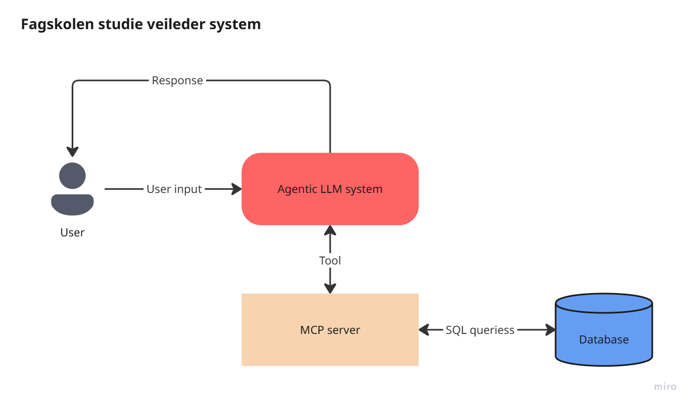
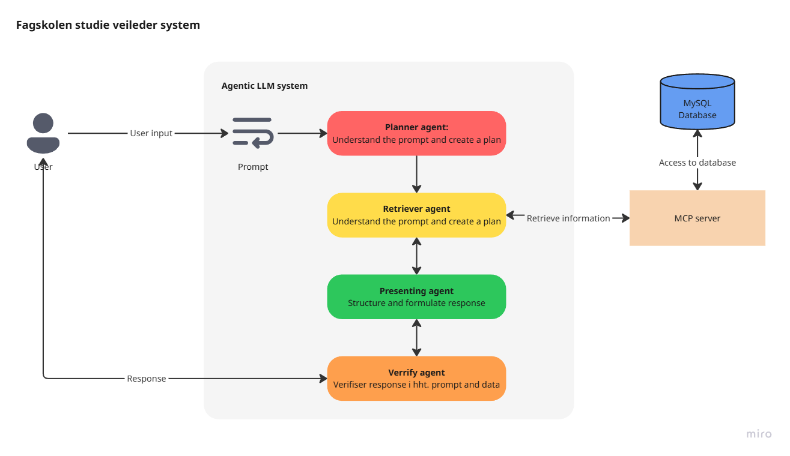

# Fagskolen Viken - AI-basert Studieveileder

Et KI-basert program som har kunnskap om alle studiene ved Fagskolen i Viken. Programmet kan:
- Svare på spørsmål om studietilbud og innhold (for nyansatte og veiledere)
- Støtte potensielle studenter i å finne riktig studie basert på behov og interesser

**High level beskrivelse:**


**Eksempel på agent work flow:**


## Systemarkitektur

Prosjektet består av fire hovedkomponenter:

1. **Web Scraping** - Henter studieinformasjon fra Fagskolen Viken nettsider
2. **MySQL Database** - Lagrer strukturert data om studier og emner
3. **MCP Server** - Tilbyr API-tilgang til databasen via MCP (Model Context Protocol)
4. **Multi-Agent System** - Intelligent agent-system som svarer på brukerspørsmål

Datakilde: [Studier – Fagskolen Viken](https://fagskolen-viken.no/studier?f%5B0%5D=apent_for_opptak%3A1)

## Datainnhold

Systemet lagrer følgende informasjon om **studieprogram**:
- Hovedtekst / beskrivelse av studiet
- Studiepoeng
- Undervisningsspråk
- Nivå
- Hvorfor velge dette studiet?
- Hva lærer du?
- Undervisning og samlinger
- Obligatorisk oppmøte
- Politiattest (der det finnes)
- Karrieremuligheter
- Kontaktinfo
- Lenke til studie
- Studielokasjon

Informasjon om **emner/kurs**:
- Lenke til hvert emne
- Studiepoeng
- Studienivå
- Læringsutbytte (Kunnskap, Ferdigheter, Generell kompetanse)

## Installasjon og Oppsett

### Hurtigstart (automatisk setup)

For rask oppsett, bruk det medfølgende setup-skriptet:

```bash
chmod +x setup.sh
./setup.sh
```

Dette vil automatisk:
- Sjekke at alle nødvendige verktøy er installert (Python 3, Docker, Docker Compose)
- Installere Python-pakker fra requirements.txt
- Starte MySQL database med Docker Compose
- Opprette database-skjema

### Manuell installasjon

### Forutsetninger
- Python 3.9+ 
- Docker og Docker Compose
- Git

### 1. Installer Python-pakker

```bash
pip install -r requirements.txt
```

Se [DEPENDENCIES.md](DEPENDENCIES.md) for fullstendig liste over avhengigheter.

### 2. Start MySQL Database

```bash
cd MySQL
docker-compose up -d
```

Standard database-innstillinger:
- **Host:** localhost
- **Port:** 3306
- **Database:** fagskolen
- **User:** admin
- **Password:** admin

### 3. Initialiser Database

```bash
cd Scraping
python create_database.py
```

Dette kjører SQL-skriptet `TurbotroebbelSQL.sql` for å opprette nødvendige tabeller.

## Bruk

### Steg 1: Skrape Data fra Nettsiden

Kjør fullstendig scraping-pipeline:

```bash
cd Scraping
python main.py
```

Dette vil:
1. Opprette database-skjema
2. Hente alle studie-URLer fra fagskolen-viken.no
3. Ekstrahere data for hvert studieprogram og emne
4. Lagre data som JSON-filer i `json_for_processing/`
5. Laste data inn i MySQL-databasen

**Alternative kommandoer:**

```bash
# Kun hente studie-URLer (lagres i studies_urls.json)
python get_studies.py

# Kun push JSON-filer til database (dry-run for testing)
python Push2SQL.py --dry-run

# Push til database
python Push2SQL.py
```

### Steg 2: Start MCP Server

MCP-serveren eksponerer database-verktøy for agenter via HTTP.

```bash
cd FastMCP_server
python mcp_server.py
```

Serveren starter på `http://127.0.0.1:8001/mcp`

**Tilgjengelige verktøy:**
- `get_study_program_categories` - Hent studieprogramkategorier
- `get_study_programs_names` - List alle studieprogram
- `get_study_program_datafields` - List tilgjengelige datafelt
- `get_study_program_datafields_values` - Hent verdier for et program
- `get_course_datafields` - List datafelt for kurs
- `get_course_datafields_values` - Hent kursinformasjon
- `get_study_program_courseIDs` - Hent kurs-IDer for et program
- `get_study_program_location` - Hent studiested

### Steg 3: Kjør Agent-systemet

Agent-systemet bruker MCP-serveren til å svare på spørsmål om studieprogram.

**Konfigurasjon:**

1. Opprett `.env`-fil i `fagskolen_agent/` med Google API-nøkkel:
```
GOOGLE_API_KEY=din_api_nøkkel_her
```

2. Kjør agenten:
```bash
cd fagskolen_agent
python agent.py
```

**Agent-arkitektur:**

- `input_agent` - Parser brukerinndata til strukturert spørring
- `retriever_agent` - Henter data via MCP-verktøy
- `Verify_agent` - Validerer og bekrefter hentet data
- `Presenting_agent` - Formaterer svar til brukeren
- `root_agent` - Koordinerer agentene og håndterer brukerinteraksjon

## Prosjektstruktur

```
.
├── Scraping/              # Web scraping og datahenting
│   ├── main.py           # Hovedpipeline for scraping
│   ├── get_studies.py    # Henter studie-URLer
│   ├── DataExtractor.py  # Ekstraerer data fra HTML
│   ├── create_database.py # Oppretter database-skjema
│   ├── Push2SQL.py       # Laster data inn i MySQL
│   └── TurbotroebbelSQL.sql # Database-skjema
│
├── FastMCP_server/        # MCP server for database-tilgang
│   ├── mcp_server.py     # Server-oppsett og verktøy-registrering
│   ├── database_connection.py # Database-tilkobling
│   ├── study_program_tools.py # Verktøy for studieprogram
│   ├── courses_tools.py  # Verktøy for kurs
│   ├── courseid_lookup_tools.py # Kurs-ID lookup
│   └── location_lookup_tools.py # Lokasjon lookup
│
├── fagskolen_agent/       # Multi-agent system
│   ├── agent.py          # Agent-konfigurasjon og workflow
│   └── __init__.py
│
├── MySQL/                 # Database-konfigurasjon
│   └── docker-compose.yaml # Docker setup for MySQL
│
├── Images/                # Dokumentasjonsbilder
├── requirements.txt       # Python-avhengigheter
├── DEPENDENCIES.md        # Detaljert avhengighetsdokumentasjon
└── README.md             # Denne filen
```

## Feilsøking

### MySQL Connection Issues
- Sjekk at Docker-containeren kjører: `docker ps`
- Verifiser at port 3306 er ledig
- Sjekk database-credentials i `docker-compose.yaml`

### Import Errors
- Installer alle pakker: `pip install -r requirements.txt`
- Bruk Python 3.9 eller nyere
- Vurder å bruke virtuelt miljø: `python -m venv venv`

### MCP Server Connection
- Sjekk at serveren kjører på port 8001
- Verifiser URL i `fagskolen_agent/agent.py`: `http://127.0.0.1:8001/mcp`

## Lisens

Dette er et utdanningsprosjekt for Fagskolen Viken.
